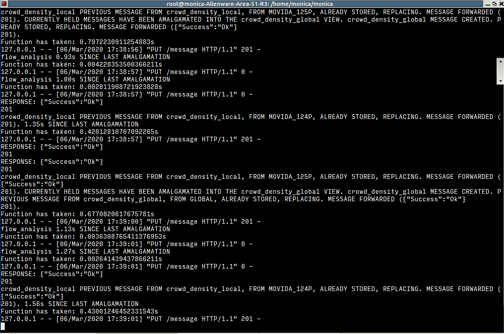

# Security Fusion Node Setup

Security Fusion Node (SFN) is a platform to calibrate the camera stream and setup datastream flow to the various algorithms and direct the algorithm outputs to different ports.

The document outlines software requirements, camera calibration process and activation of the SFN to manage the datastreams.
SFN typically receives data from VCA core. Please reffer to the [VCA Installation tutorial](VCAcore_Installation.md) for more details. 

## Software Requirements
* Linux 16.04
* Nvidia drive 384 and above
* CUDA 9.0
* Docker
* MySQL

## Download and install MONICA WP5 Repo

1. At the home directory, if not installed, then download WP5 Repo

> git clone https://github.com/MONICA-Project/sfn.git

2. Install MySQL. Refer this [link](https://www.digitalocean.com/community/tutorials/how-to-install-mysql-on-ubuntu-16-04) for detailed instructions on MySQL setup. Keep the username "root" and password "root".

> sudo apt-get update <br/>
> sudo apt-get install mysql-server <br/>
> mysql_secure_installation (answer all question default, do not change the password) <br/>
> mysqld --initialize (you will see an error, indicates file already exist) <br/>
> mysqladmin -p -u root version (checks if MySQL is up and running) <br/>

3. Check if MySQL is up and runing and will be run automatically on boot.

> systemctl status mysql.service <br/>
> mysqladmin -p -u root version

4. If MySQL is not running, run followings, else ignore following:

> sudo systemctl start mysql

5. Log in to the MySQL and check databases

> mysql -u root -p <br/>
> SHOW DATABASES;

6. Initialise WP5 mysql databases. (make sure no error pops)

> mysql -u root -p < monica/WP5/KU/SecurityFusionNodeService/mysql_setup_db.sql <br/>

7. Log in to the mysql and check if 2 databases are installed      (sfn_database & log_database)

> sudo mysql -u root -p         (password: root) <br/>
> SHOW DATABASES;               ( check the databases table)

## SFN Docker Image

To ensure all the required dependencies for SFN are available, install the following dependencies.

> sudo apt install python3-pip </br>
> sudo pip3 install -r monica/WP5/KU/SecurityFusionNodeService/requirements.txt </br>
> sudo pip3 install -r monica/WP5/KU/KUConfigTool/requirements.txt </br>
> sudo pip3 install -r monica/WP5/KU/Algorithms/requirements.txt </br>
> sudo apt-get install python3-tk </br>
> sudo apt-get install vlc </br>

If the SFN docker image is not built, then go to the ```monica``` folder and build the SFN image.

> sudo docker build -f Dockerfile_sfn -t sfn . <br/>

The docker build takes a while and check the build messages for errors.

The docker image is run using ```sudo docker run --net="host" -t sfn```. Keep the terminal open to see the transactions in the docker and any error messages.

The ```docker run``` command starts the SFN docker image. For the SFN to send algorithm observations to SCRAL, the calibrated camera needs to be registered by running the camera registration file.

Keep the SFN run terminal and in a separate terminal at ```cd monica``` location run the camera registration python file (```xxx.py```) using the command: ```python3 WP5/KU/SecurityFusionNodeService/xxx.py```.

Refer to the [camera calibration](Camera_Calibration.md) document for calibrating the camera and preparing the camera registration file.

## Camera registration

The camera calibration process creates two files - a text file  in ```KUConfigTool``` folder and ```.PK``` file in ```cam_config``` folder. Based on the ```.PK``` files, a camera registration file is to be created.

The registration file is a ```python file``` necessary to register the cameras to the ```SCRAL endpoint```. It ensures the desired camera messages are forwarded.

The camera registration file is to be placed in the ```SecurityFusionNodeService``` folder. Use the template camera registration file already provided.

Two changes are particularly to be made/verified in the registration file. The ```SCRAL endpoint``` on the SFN. Ensure the correct camera config files, i.e. the ```.PK``` files are listed in the camera registration file.

The camera registration file is run using the following:

> python3 WP5/KU/SecurityFusionNodeService/XXX_reg.py

Once the registration file is run, check the terminal where the SFN is running. If everything is correct, it shows the camera registration messages forwarded.



The camera registration file needs to be run everytime the SFN is restarted.

## Contributing
Contributions are welcome. 

Please fork, make your changes, and submit a pull request. For major changes, please open an issue first and discuss it with the other authors.

## Affiliation
  
This work is supported by the European Commission through the [MONICA H2020 PROJECT](https://www.monica-project.eu) under grant agreement No 732350.
