# VCAcore (MONICA) Installation
VCAcore is the platform which handles both the RTSP stream processing pipeline and the integration of the various algorithms within that pipeline.

These instructions will outline the process to install the MONICA build of VCAcore, link this install with the various python algorithms and configure channels fro processing.

<div style="page-break-after: always;"></div>

## Install VCAcore

### Download and install the package

The MONICA build of VCAcore requires Ubuntu 16.04 and the install package is available here:

```https://bscw.fit.fraunhofer.de/sec/bscw.cgi/d49620600/VCA-Core-0.0.0-2019-07-05T10-28-54-f7c3b26-Rel-vca_core.sh```

When downloaded give the file executable rights:

```chmod +x VCA-Core-0.0.0-2019-07-05T10-28-54-f7c3b26-Rel-vca_core.sh ```

Run the installation script:

```./VCA-Core-0.0.0-2019-07-05T10-28-54-f7c3b26-Rel-vca_core.sh ```

Follow the installation instructions making sure to note the install location of the software

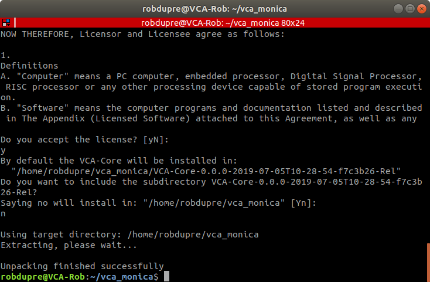

### Adding RTSP Video Sources to VCAcore

#### Activation

For VCAcore to process video streams a licence must be present. To licence VCAcore an **activation code**, linked to your hardware configuration (via the **hardware code**) must be input. Temporary licences are available on request from VCA Technology and will last 45 days.

To manage activation and hardware codes, navigate to the license settings page:

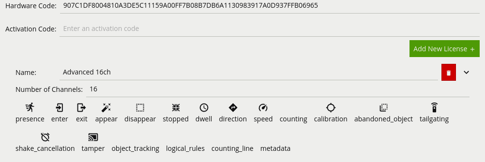

-   **Hardware Code:** The unique hardware code for this device. Needed to generate an activation code.

-   **Activation Code:** Enter an activation code to enable additional functionality or channels.


##### Steps to Activate Additional Functionality

-   Copy the hardware code and send it to VCA Technology.

-   VCA Technology will return an activation code.

-   Apply the activation code to the device and verify the required features are activated.

#### Adding RTSP Video Sources

Video sources are automatically linked with a channel when added. The number of video sources which can be added to the system is dependant on the user's license (see above). To add a video source, navigate to the Edit Sources page and click the green Add Video Source button. The two primary video source types are outlined below:

### File

File sources stream video from a local sample file located in ``VCAcore_install_dir/share/test-clips/``.

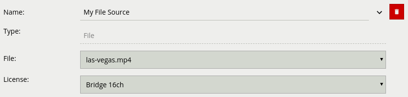

**Properties:**

-   **File:** The name of the file.

### RTSP

RTSP sources stream video from remote RTSP sources such as IP cameras and encoders.

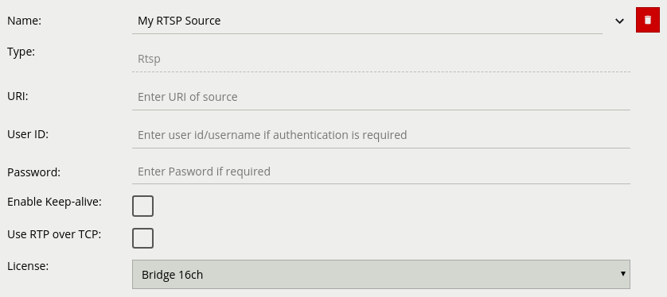

**Properties:**

-   **URI:** The fully qualified URI to the remote RTSP endpoint.
-   **User ID:** The username to access the RTSP endpoint (if applicable).
-   **Password:** The password to access the RTSP endpoint (if applicable).
-   **Enable Keep-alive:** Periodically sends commands to the RTSP source to keep the RTSP connection alive. Most RTSP sources require this option to be enabled. Disable this option only if the RTSP source does not support this behaviour.
-   **Use RTP over TCP:** Force the RTP stream to be streamed via TCP (instead of UDP). Wherever possible, RTSP streams should be delivered over TCP and not UDP. This is because UDP transport is not robust against packet loss and dropped packets cause corrupt video which causes VCAcore to generate false positives.

Once a video source has been added the stream will be visible in the View Channels page. Each added channel has a ```channel_id``` which, when viewing the steam will be present in the url ```http://192.168.1.71:8080/#view-channels/0```. This ```channel_id``` is required to synchronise messages from VCAcore to the SFN and on to the SCRAL

## Gate Counting

Once the RTSP streams have been added to VCAcore, instructions for configuring the gate counting algorithm can be found in section 12.3.11 (page 57) of the VCAcore manual available here: [VCAcore Manual](https://vcatechnology.s3-eu-west-1.amazonaws.com/docs/vca-core-manual-1.0.2r2.pdf)

### Sending Gate Counting Messages to the SCRAL

VCAcore supports HTTP actions which facilitate the sending of data via HTTP / TCP or email. To send the output of the MONICA algorithms to the SFN or to SCRAL an HTTP action must be configured.

For gate counting two actions are required per gate counting line added to the system, one for events when the count is increased and another for when the count decreases.

To add these actions navigate to the Edit Actions page and click Add Actions -> Http:

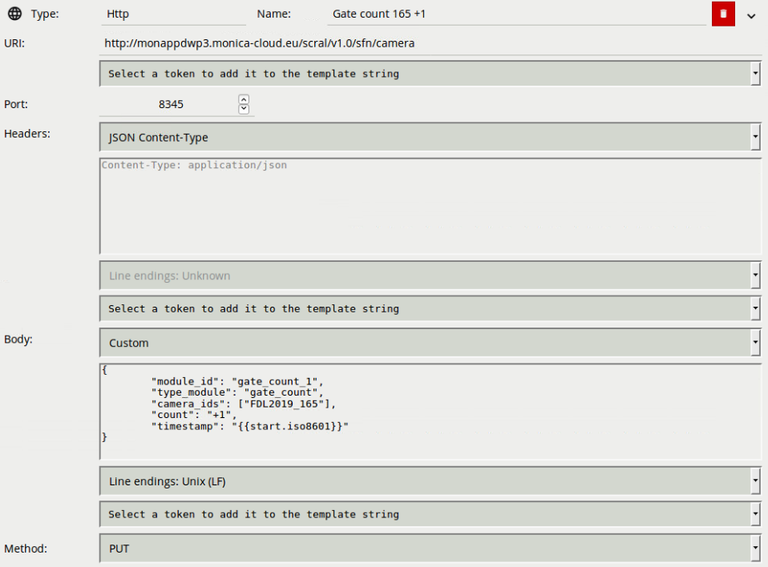

* **URI:** The URI to the instance of the SCRAL including the ``/sfn/camera`` endpoint.
* **Port:** The port the SCRAL service is running on.
* **Body:** These setting will be specific to site but the ``camera_ids`` should relate to the ``id`` for the camera  defined when calibrated using KU Configuration Tool

For an an action to send it must be configured with a source. Sources are added via the Add Source button in which a list of available sources will be presented in a drop down list. Select the rule source that corresponds to the line cross event triggered when the count increases.

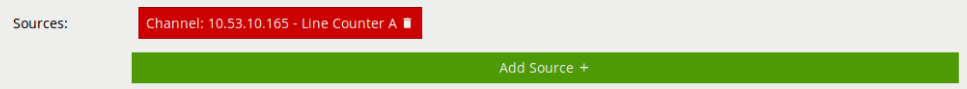

For the count decrease event, create another HTTP action as above with the the following change to the body:

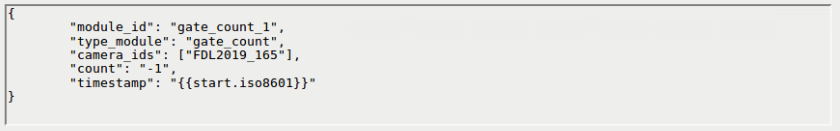

Select the line cross event triggered when the count decreases as the source.

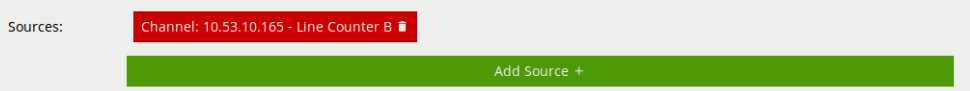

## Fight Detection

The MONICA build of VCAcore comes with the Fight Detection algorithm build in. To enable the algorithm go to an added channel and open the settings menu, selecting Deep Learning from the options.

Enable the Fight Detection check box to turn on fight detection for the currently selected channel.

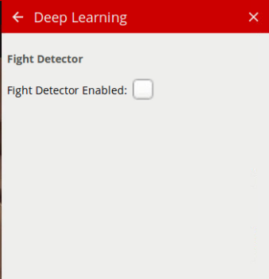

### Sending Fight Detection Messages to the SCRAL

Fight detection messages are sent directly to the SCRAL via HTTP. To add this action navigate to the Edit Actions page and click Add Actions -> Http:

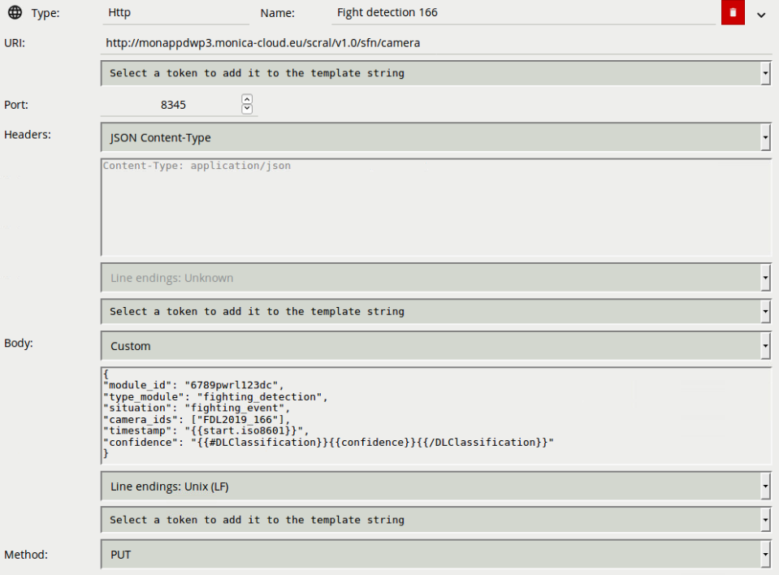

* **URI:** The URI to the instance of the SFN including the ``/message`` endpoint.
* **Port:** The port the SFN service is running on.
* **Body:** These setting will be specific to site but the ``camera_ids`` should relate to the ``id`` for the camera  defined when calibrated using KU Configuration Tool.

All other settings should be as outlined in the image above.

Any channel where the fight detection algorithm has been enabled will appear as a source for the action:

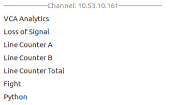

Select the **Fight** source.

## Crowd Density and Optical Flow

The MONICA build of VCAcore has a custom pipeline entry point to allow the other MONICA partner's algorithms to make use of the decoded frames.

To enable the use of the crowd density and optical flow algorithms with VCAcore, the algorithm repository must first be downloaded and a simulink between the algorithm repository and VCAcore installation directory created.

### Create symbolic link with MONICA algorithms

First navigate to user root directory

```cd ~```

clone the algorithm repository onto the host system. XXX DOWNLOAD THE MONICA WP5 REPO XXX

```git clone -b KU_dev https://scm.fit.fraunhofer.de/scm/git/monica```

once cloned navigate to ``~/vca_monica/lib/algorithms/python/KU_algorithm`` and create the symbolic link to the algorithm repository:

``ln -s ~/monica/ .``

### Create Settings File

A ``settings.json`` file must be created in  ``~/vca_monica/lib/algorithms/python/KU_algorithm`` to allow VCAcore to load configuration files generated by the KU config tool to a specific ``camera_id``. The settings file consists on key-value pairs where the key is the VCAcore ``camera_id`` and the value is the location of the configuration files generated by the KU config tool. An example config file is described below:

```
{
    "0": {
        "calibration_file": "/home/monica/monica/WP5/KU/KUConfigTool/FDL2019_161_reg.txt"
    },
    "1": {
        "calibration_file": "/home/monica/monica/WP5/KU/KUConfigTool/FDL2019_164_reg.txt"
    },
    "2": {
        "calibration_file": "/home/monica/monica/WP5/KU/KUConfigTool/FDL2019_165_reg.txt"
    },
    "3": {
        "calibration_file": "/home/monica/monica/WP5/KU/KUConfigTool/FDL2019_162_reg.txt"
    },
    "4": {
        "calibration_file": "/home/monica/monica/WP5/KU/KUConfigTool/FDL2019_166_reg.txt"
    },
    "5": {
        "calibration_file": "/home/monica/monica/WP5/KU/KUConfigTool/FDL2019_167_reg.txt"
    },
    "6": {
        "calibration_file": "/home/monica/monica/WP5/KU/KUConfigTool/FDL2019_163_reg.txt"
    }
}
```

With the settings file and simulink in place, VCAcore will load it's python interface and pass frames from cameras (with ``camera_ids`` listed in the settings file) to the algorithms for processing. A

### Sending Crowd Density and Optical Flow Messages to the SFN

Crowd Density and Optical Flow messages are sent to the SFN for processing and storage via a single HTTP action. To add this action navigate to the Edit Actions page and click Add Actions -> Http:

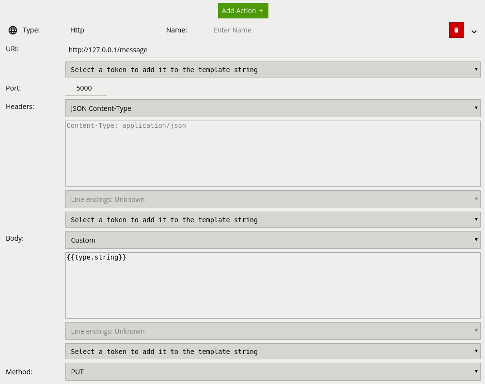

* **URI:** The URI to the instance of the SFN including the ``/message`` endpoint.
* **Port:** The port the SFN service is running on.

All other settings should be as outlined in the image above.

A **Python** source will be available from the Add Source menu for all channels.

which are running algorithms on must be added to the action. The source


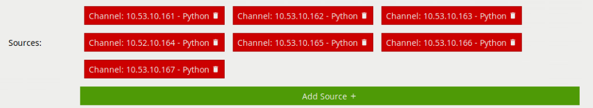


### Setup VCAcore as a Service

As part of the installed files is a python script which automatically sets up a ```systemctl``` service which will start the vca-cored when the system restarts.

navigate to the install directory ```/bin``` folder:

```cd vca_monica```

and run:

```python generate_vca_cored_service.py USERNAME```

This must be run from the directory containing the ``.py`` as it uses the execution directory to configure the service.
